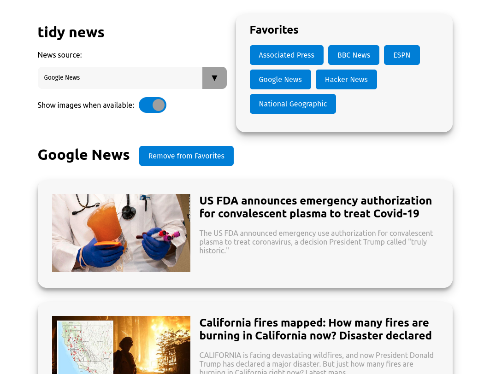

# tidy news

Put the news back in its proper place.

## Overview

__tidy news__ is a React SPA that allows you to access the top news stories from over 100 sources in one place, so you can get the news you need and then get on with your life.

Features include:

* Select from over 100 news sources
* Limit of 10 stories at a time per news source and no endless scroll
* Add/remove news sources from your Favorites
* Toggle whether you want to see images for stories or not
* Respects your system's light/dark mode settings (view images above)
* Current news source, Favorites, and image preference are saved in the browser's local storage so you can pick up where you left off
* Completely responsive, and can be made a progressive web app if desired

_Note: Due to recent changes in the [News API](https://newsapi.org/)'s free tier, this app can not run on a custom domain without a paid account. However, this app can still be used to check the news for free on_ `localhost`.

## To use locally

1. Clone repo, and `cd tidy-news`
2. Run `npm i`
3. Run `cp .env.example .env`
4. Go to https://newsapi.org/register and sign up for a free api key
5. Add your api key to your new `.env` file
6. Run `npm start` or `yarn start`
7. Open [http://localhost:3000/](http://localhost:3000/) to see __tidy news__!

When you’re ready to deploy to production, create a minified bundle with `npm run build`.

## To use in production

If you have a paid [News API](https://newsapi.org/) account and want to deploy __tidy news__ to a domain, running `npm run build` or `yarn build` will build the app for production to the `build` folder.

This correctly bundles __tidy news__ in production mode and optimizes the build for the best performance.
